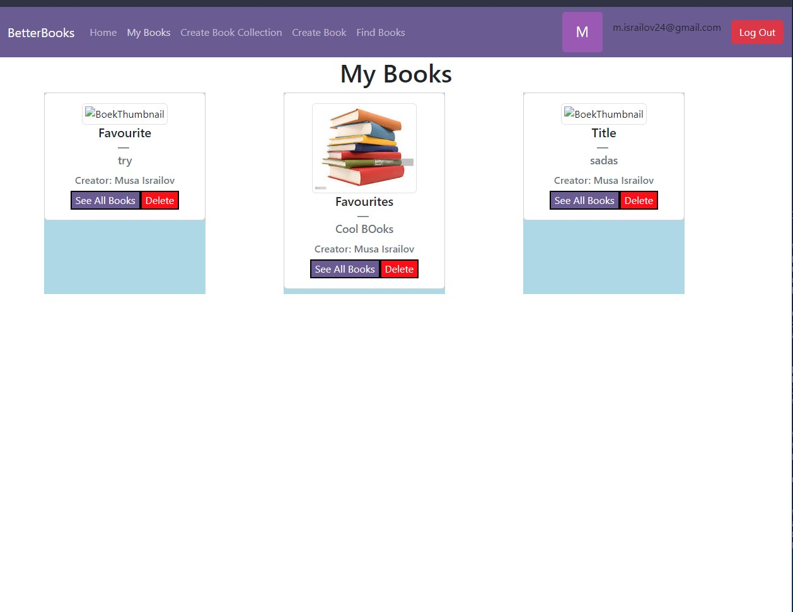

# Voornaam Familienaam (Studentennummer)
Musa Israilov

- [x] Front-end Web Development
  - [GitHub repository](https://github.com/Web-IV/2223-frontendweb-Misrailov)
  - [Online versie](https://frontendweb-misrailov.onrender.com/)
- [x] Web Services: GITHUB URL
  - [GitHub repository](https://github.com/Web-IV/2223-webservices-Misrailov)
  - [Online versie](https://webservices-misrailov.onrender.com/)

**Logingegevens**

- Gebruikersnaam/e-mailadres:e2e-testing@budgetapp.be
- Wachtwoord:123testBLa123

## Projectbeschrijving

Ik heb een applicatie gemaakt waarin een persoon kan inloggen en boeken die hij leuk vind kan opslaan. Dit kan die doen door vooraleer in te loggen, daarna creert die een collectie. Je hebt een (beperkte) zoekfunctie waarmee je boeken kan vinden en toevoegen. Ook heb je een aparte pagina waar je zelf een boek kan samenstellen en toevoegen.
Elke user of person in mijn db heeft dus meerdere bookCollections, elke collection bevat dan ook boeken die hij of zij eraan heeft toegevoegd.

Hier heb je ook een simpel model aangemaakt met de kroki erd uit de les:

## Screenshots

> Voeg enkele (nuttige!) screenshots toe die tonen wat de app doet.

## Behaalde minimumvereisten

### Front-end Web Development

- **componenten**

  - [x] heeft meerdere componenten - dom & slim (naast login/register)
  - [x] definieert constanten (variabelen, functies en componenten) buiten de component
  - [x] minstens één form met validatie (naast login/register)
  - [x] login systeem (eigen of extern zoals bv. Auth0)
 

- **routing**
  - [x] heeft minstens 2 pagina's (naast login/register)
  - [x] routes worden afgeschermd met authenticatie en autorisatie
 

- **state-management**

  - [x] meerdere API calls (naast login/register)
  - [x] degelijke foutmeldingen indien API call faalt
  - [x] gebruikt useState enkel voor lokale state
  - [x] gebruikt Context, useReducer, Redux… voor globale state
 

- **hooks**

  - [x] kent het verschil tussen de hooks (useCallback, useEffect…)
  - [x] gebruikt de hooks op de juiste manier
 

- **varia**
  - [x] een aantal niet-triviale testen (unit en/of e2e en/of ui)
  - [x] minstens één extra technologie
  - [x] duidelijke en volledige README.md
  - [x] volledig en tijdig ingediend dossier

### Web Services

- **datalaag**

  - [x] voldoende complex (meer dan één tabel)
  - [x] één module beheert de connectie + connectie wordt gesloten bij sluiten server
  - [x] heeft migraties (heb als voorbeeld ook van knex)
  - [x] heeft seeds (heb van knex en prisma allebei seeds)
 

- **repositorylaag**
  (Niet toepasslijk, Prisma gebruikt)
  - [] definieert één repository per entiteit (niet voor tussentabellen) - indien van toepassing
  - [] mapt OO-rijke data naar relationele tabellen en vice versa
 

- **servicelaag met een zekere complexiteit**

  - [x] bevat alle domeinlogica
  - [x] bevat geen SQL-queries of databank-gerelateerde code
 

- **REST-laag**

  - [x] meerdere routes met invoervalidatie
  - [x] degelijke foutboodschappen
  - [x] volgt de conventies van een RESTful API
  - [x] bevat geen domeinlogica
  - [x] degelijke authorisatie/authenticatie op alle routes
 

- **varia**
  - [x] een aantal niet-triviale testen (min. 1 controller >=80% coverage)
  - [x] minstens één extra technologie
  - [x] duidelijke en volledige `README.md`
  - [x] maakt gebruik van de laatste ES6-features (object destructuring, spread operator...)
  - [x] volledig en tijdig ingediend dossier

## Projectstructuur

### Front-end Web Development

Er was in het begin van mijn opdracht iets fout gelopen wat ik pas zeer laat had beseft, mijn root folder is voor het opstarten en dergelijke de my-app folder. Wat op het einde wat problemen had gebracht. Maar voor de rest is het Een normale structuur.
Ik heb natuurlijk App.js en Index.js zoals iedereen, dan heb ik een map api. Deze map wordt niet enkel gebruikt om query's te doen op mijn eigen databank, maar heeft ook bv bookGoogle.js waarin er query's gedaan worden naar een book api van google en ook een van NY Times.
Dan heb ik nog een Grote Folder Components, waarin je context en authentication heb zoals iedereen. Ik heb een Dropdown map, waarin componenten van die stijl in zitten, dan heb ik een DisplayBookComponent. In deze map zitten de componenten die eigenlijk een opsomming van componenten ophalen. Een map form voor de forms. Een map Pages voor de aparte paginas.
Ik heb zo goed als ik kan de domme en slimme componenten opgesplitst, ook gebruik ik state voor lokale staat.

### Web Services

In mijn root folder heb ik de package.json en dergelijke. Eenmaal dat je in de src folder heb kom je het eerst de index.js en createServer tegen. Dan heb ik gewoon de structuur van de cursus gevolgd. Ik heb een rest folder, een service folder, een data folder en een core folder. Ik heb geen repositorylaag omdat ik Prisma gebruik. Ook heb ik in de data folder in de index ook knex opgesteld. Dit heb ik gedaan en zo gelaten, zodat als ik zou verderwerken, dat deze mogelijkheid niet verwijnt.

## Extra technologie

### Front-end Web Development

Ik heb vooral gebruik gemaakt van react-bootstrap om mijn componenten op te stellen. Ik heb dus een UI library gebrtuikt als extra.

### Web Services

Ik heb Prisma gebruikt als ORM, dit is dus mijn extra. Voor de zekerheid heb ik ook linting gedaan als klein extraatje.
 - [Prisma](https://www.npmjs.com/package/prisma)
 - [ESLint](https://www.npmjs.com/package/eslint)
## Testresultaten

### Front-end Web Development

-HomePage bestaat test

-Mybooks pagina bestaat test

-Bookcollection creeren test

Ik heb enkel wat basistesten gedaan die de belangrijkste dingen testen. Als ik dus op de website aankom, zijn de nodige componenten te zien op het scherm.
Ook heb ik getest dat ik de collection cards te zien krijg bij het gaan naar de pagina mybooks. Ook heb ik uitgetest of ik een collection aan kan maken.

### Web Services

-person Testen

-bookCollection Testen

-bookCollectionLinktable testen

Ik heb volledig de person file getest uit de rest laag. Dit is dan dus alle CRUD-operaties die we hebben gezien. GET,POST,PUT,DELETE. Daarnaast heb ik ook 1 singuliere geslaagde test uit de andere files.

## Gekende bugs
Momenteel zijn er geen gekende bugs, De testen doen wel wat moeilijk omdat het is op basis van of er mensen nog zijn toegevoegd in de databank. Ook doet Prisma vaak wel lastig.

### Front-end Web Development

Als je op bepaalde knoppen die CRUD-operaties doen  snel drukt, dan kan het gebeuren dat de error niet gecatched wordt.

### Web Services

Voor alle normale en correcte zaken die worden uitgevoerd heb ik geen problemen ervaren.

